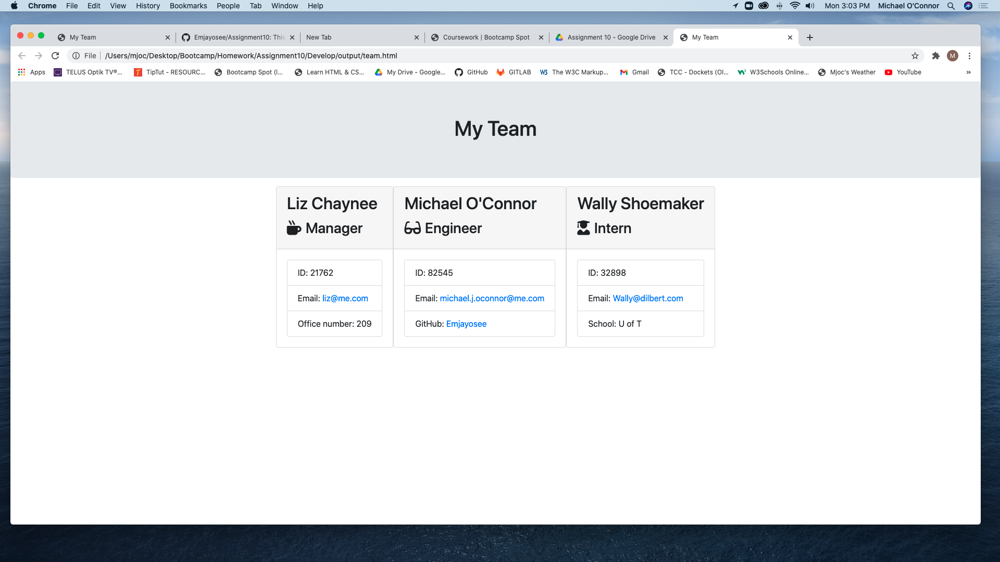

# Assignment10

This is the repo for Assignment 10 due February 16, 2021.
To run the app (see video link below under Current Renderings) or from the command line in the Develop folder, install NPM and run [node app.js].

# Unit 10: Team Profile Generator

Submitted: March 8, 2021, Michael O'Connor, 604 765 6061

   * [01 Goal](#01-goal)
   * [02 Approach](#02-approach)
   * [03 Deliverable Requirements](#03-deliverable-requirements)
   * [04 Testing and Quality Control](#04-testing-and-quality-control)
   * [05 Lessons Learned](#05-lessons-learned)
   * [06 Further Developments](#06-further-developments)
   * [07 Current Renderings:](#07-current-renderings)
   * [08 Installation Instructions](#08-installation-instructions)
   * [09 Usage Info:](#09-usage-info)
   * [10 Contribution Guidelines](#10-contribution-guidelines)
   * [11 Licence](#11-licence)
   * [12 Questions](#12-questions)

# 01 Goal: 

    The goal is to build a Node.js command-line application that takes in information about employees 
    on a software engineering team, then generates an HTML webpage that displays summaries for each 
    person. Testing is key to making code maintainable, so I must also write a unit test for every 
    part of your code and ensure that it passes each test.  Much of the code is pre-written.

# 02 Approach:

    In approaching this project, I at first struggled to get the inquirer routine going.  Then after
    a tutorial, I was able to do so but still needed to develop the unique requirements for each team
    member.  To simplify the inputs, I studied how to work with switch statements and then created 
    the same data routine for all employees, but switched the final question depending on the role 
    of the person.  THis I felt made more sense in case there ever was an "inband" reporting situation.

    Acceptance requirements include: 
            
            [X] A command-line application that accepts user input.
            [X] On prompted for team members and their information, an HTML file is generated 
                that displays a nicely formatted team roster based on user input.
            [X] In the HTML file, the email address in the HTML opens my default email program 
                and populates the TO field of the email with the address.
            [X] WHEN I click on the GitHub username, that GitHub profile opens in a new tab
            [X] WHEN I start the application I am prompted to enter details of my team including:
                    - name, 
                    - employee ID, 
                    - email address, and 
                    - depending on the rolem the office number (for Manager), the GitHub ID (for Engineers)
                        and the school attended (for interns)
            [X] WHEN I decide to finish building my team and exit the application, the HTML is generated.

    I was able to get the final switch statements and the input routine working two weeks ago, but having 
    ended up with the objects being rendered via console log, it was not clear to me how that data got 
    to the other parts of the file.  I then built out the instances of each employee and could render 
    each as an object, but then I was stalled.  This slowed progress on the app and so I kept reading 
    and practising various routines, but finally with the Project 2 and other homework piling up, I 
    left it a while and only came back to this after Project 2 was completed.  Today, Luca was able 
    to explain to me how the render feature of the app had to work and with a few key strokes helped 
    to get it done.  

# 03 Deliverable Requirements:

The presentation of the project requires a link to a separate file to validate the operation of the following: 

            [X] A sample HTML file generated using the application must be submitted.

            [X] The GitHub repository containing your application code.

            [X] A walkthrough video that demonstrates the functionality of the Team Profile Generator
                and passing tests must be submitted, and a link to the video should be included in your README file.

            [X] The walkthrough video must show all four tests passing from the command line.

            [X] The walkthrough video must demonstrate how a user would invoke the application from the command line.

            [X] The walkthrough video must demonstrate how a user would enter responses to all of the 
                prompts in the application.

            [X] The walkthrough video must demonstrate a generated HTML file that matches the user input.

# 04 Testing and Quality Control:

    Testing included:

        [X] Using npm run test to ensure that the classes were appropraitely configured;
        [X] Running the routine several times to get the inquirer and switch statements working; and
        [X] Trying to produce the HTML file.

# 05 Lessons Learned:

The following topics were applied during the project:

    * How to work wiyth someone else's code

    * Screencastify

    * Inquirer via node

    * How to use switch statements in an inquirer routine

# 06 Further Developments:

    No further developments are pending.

# 07 Current Renderings:

The deployed video can be found here: https://drive.google.com/file/d/1IDKo3DIfZmKxqFxjnHaRKBGbJNNrgCxj/view?usp=sharing

# 08 Installation Instructions: 

Be sure to do an npm install.

# 09 Usage Info: 

There is no app to use.

# 10 Contribution Guidelines: 

We do not expect to develop this any further.

# 11 Licence: 

 NA

# 12 Questions: 

If there are any questions please contact me. 

